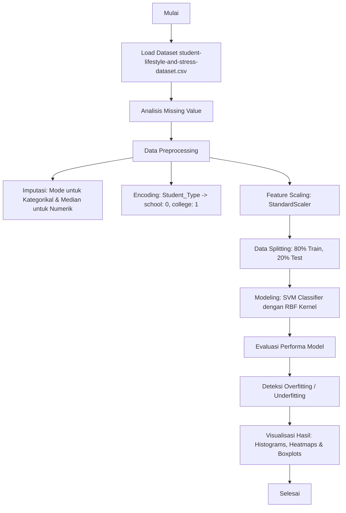

# 🧠 Klasifikasi Gaya Hidup & Tingkat Stres Siswa menggunakan Support Vector Machine (SVM)

[](https://www.python.org/)
[](https://jupyter.org/)
[](https://scikit-learn.org/)
[](https://pandas.pydata.org/)
[](https://matplotlib.org/)

Repositori ini berisi implementasi **Support Vector Machine (SVM)** dengan **Kernel Radial Basis Function (RBF)** untuk melakukan klasifikasi tingkat stres siswa berdasarkan pola gaya hidup mereka. Proyek ini diselesaikan sebagai bagian dari tugas praktik pemodelan machine learning.

---

## 👥 Anggota Tim Pengembang
1. **Muhammad Zayyan Achnaf** (NIM: `24523147`)
2. **Muhammad Rifki Apreliant** (NIM: `24523097`)

---

## 📊 Ikhtisar Dataset
Dataset yang digunakan adalah **"Student Lifestyle and Stress Dataset"** yang diperoleh dari Kaggle. Dataset ini merekam data gaya hidup mahasiswa serta tingkat stres yang dialami.

### 📋 Struktur Kolom / Fitur

| Nama Kolom | Tipe Data | Deskripsi | Penanganan Missing Value |
| :--- | :--- | :--- | :--- |
| **`Student_Type`** | Kategorikal | Tipe pelajar (`school` atau `college`) | Diisi dengan **Mode (Modus)** |
| **`Sleep_Hours`** | Numerik | Jumlah jam tidur per hari | Diisi dengan **Median** |
| **`Study_Hours`** | Numerik | Jumlah jam belajar per hari | Diisi dengan **Median** |
| **`Social_Media_Hours`** | Numerik | Waktu penggunaan media sosial (jam/hari) | Diisi dengan **Median** |
| **`Attendance`** | Numerik | Persentase kehadiran kelas (%) | Diisi dengan **Median** |
| **`Exam_Pressure`** | Numerik | Skala tekanan ujian yang dirasakan | Diisi dengan **Median** |
| **`Family_Support`** | Numerik | Skala dukungan keluarga | Diisi dengan **Median** |
| **`Month`** | Numerik | Bulan pengambilan data akademik | Diisi dengan **Median** |
| **`Stress_Level`** *(Target)* | Biner | `0` = Tidak Stres, `1` = Stres | *Tidak ada missing value* |

---

## 🛠️ Alur Kerja Proyek (Workflow)



---

## ⚙️ Detail Implementasi & Eksperimen

### 1. Imputasi Data & Rekayasa Fitur
*   **Missing Value Imputation**: Nilai kosong pada kolom numerik diisi menggunakan **Median** (bukan *mean*). Keputusan ini diambil untuk menghindari distorsi akibat nilai ekstrem (*outliers*) seperti mahasiswa dengan pola jam tidur/belajar yang sangat tidak wajar.
*   **Encoding**: Fitur `Student_Type` diubah menjadi angka biner:
    *   `school` $\rightarrow$ `0`
    *   `college` $\rightarrow$ `1`
*   **Feature Scaling**: Menggunakan `StandardScaler` untuk menyamakan bobot kontribusi setiap variabel fitur. Skala hasil pemrosesan berupa skor standardisasi:
    *   `0`: Nilai data tepat berada di rata-rata (*mean*) populasi.
    *   `Positif (+)`: Nilai berada di atas rata-rata.
    *   `Negatif (-)`: Nilai berada di bawah rata-rata.

### 2. Pembagian Data (Data Splitting)
Dataset memiliki total **25.500 baris data** yang dibagi dengan rasio **80:20**:
*   **Data Latih (Train Set)**: `20.400` data
*   **Data Uji (Test Set)**: `5.100` data

### 3. Pemilihan Model (SVM RBF Kernel)
Model menggunakan class `SVC(kernel='rbf', random_state=42)` dari Scikit-Learn.
> **Mengapa Kernel RBF (Radial Basis Function)?**
> Batas klasifikasi (*decision boundary*) antara siswa yang stres dan tidak bersifat **non-linear** dan sangat kompleks karena dipengaruhi banyak faktor gaya hidup yang saling tumpang tindih. RBF kernel secara dinamis dapat memetakan fitur ke dimensi yang lebih tinggi dan menarik batas keputusan yang melengkung secara fleksibel tanpa memerlukan modifikasi fitur secara manual.

### 4. Metrik Evaluasi Model
Model diukur menggunakan 4 metrik performa utama pada data uji:
1.  **Accuracy**: Seberapa besar persentase tebakan benar model dari keseluruhan data uji.
2.  **Precision**: Mengukur rasio ketepatan model—dari semua yang diprediksi "Stres", berapa banyak yang benar-benar mengalami stres.
3.  **Recall**: Mengukur sensitivitas model—dari total orang yang aslinya stres di dunia nyata, berapa persen yang berhasil dideteksi oleh model.
4.  **F1-Score**: Rata-rata harmonis yang merepresentasikan keseimbangan antara *Precision* dan *Recall*.

### 5. Analisis Fit Model
Model secara otomatis membandingkan akurasi data latih (`acc_train`) dan data uji (`acc_test`) dengan logika berikut:
*   **Overfitting**: Jika $\text{Akurasi Train} - \text{Akurasi Test} > 0.05$. (Model menghafal data latihan tetapi gagal digeneralisasi ke data baru).
*   **Underfitting**: Jika akurasi train dan test keduanya $< 0.65$. (Model gagal mempelajari pola data secara umum).
*   **Good Fit**: Jika perbedaan akurasi seimbang/kecil. (Model optimal).

---

## 📈 Visualisasi yang Dihasilkan
Visualisasi dibuat menggunakan canvas `matplotlib` berukuran `18x5` inci yang menyajikan tiga grafik informatif berdampingan:
1.  **Distribusi Kelas Target (`Stress_Level`)**: Menampilkan jumlah sebaran sampel kelas `0` (Tidak Stres) vs `1` (Stres) untuk memastikan apakah dataset seimbang (*balanced*).
2.  **Confusion Matrix Heatmap**: Memvisualisasikan detail tebakan model versus label sebenarnya (*True Positive, True Negative, False Positive, False Negative*).
3.  **Boxplot Hubungan Jam Tidur & Tingkat Stres**: Menganalisis sebaran statistik jam tidur pada kelompok siswa stres vs tidak stres.

---

## 🚀 Cara Menjalankan Notebook

### Prasyarat (Prerequisites)
Pastikan Anda sudah menginstal Python (minimal versi 3.8) beserta beberapa library pendukung.

### 1. Instalasi Library
Jalankan perintah berikut di terminal/command prompt Anda untuk menginstal semua dependensi yang diperlukan:
```bash
pip install pandas numpy scikit-learn matplotlib seaborn jupyter
```

### 2. Jalankan Jupyter Notebook
Aktifkan Jupyter Notebook server di dalam direktori proyek ini:
```bash
jupyter notebook
```
Atau jika menggunakan Jupyter Lab:
```bash
jupyter lab
```
Buka file `Praktik_SVM.ipynb` dan jalankan semua cell secara berurutan (*Run All*).

### 💡 Menggunakan Google Colab
1. Unggah file `Praktik_SVM.ipynb` ke Google Drive Anda.
2. Buka notebook menggunakan Google Colaboratory.
3. Unggah file dataset `student-lifestyle-and-stress-dataset.csv` ke direktori `/content/sample_data/` di sesi runtime Colab Anda agar kode pembacaan dataset berjalan lancar tanpa modifikasi path.

---

## 📄 Lisensi
Proyek ini dibuat untuk tujuan akademik dan edukasi. Anda dipersilakan untuk menyalin, memodifikasi, dan membagikan ulang kode ini.

<div align="center">

**Dibuat dengan ❤️ oleh Kelompok Praktik SVM (Muhammad Zayyan Achnaf & Muhammad Rifki Apreliant)**

</div>
